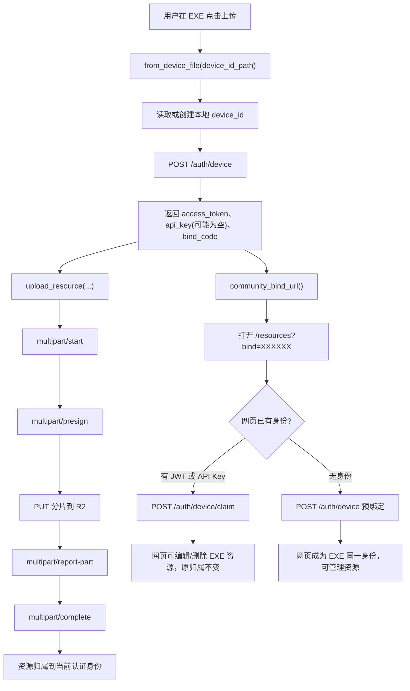
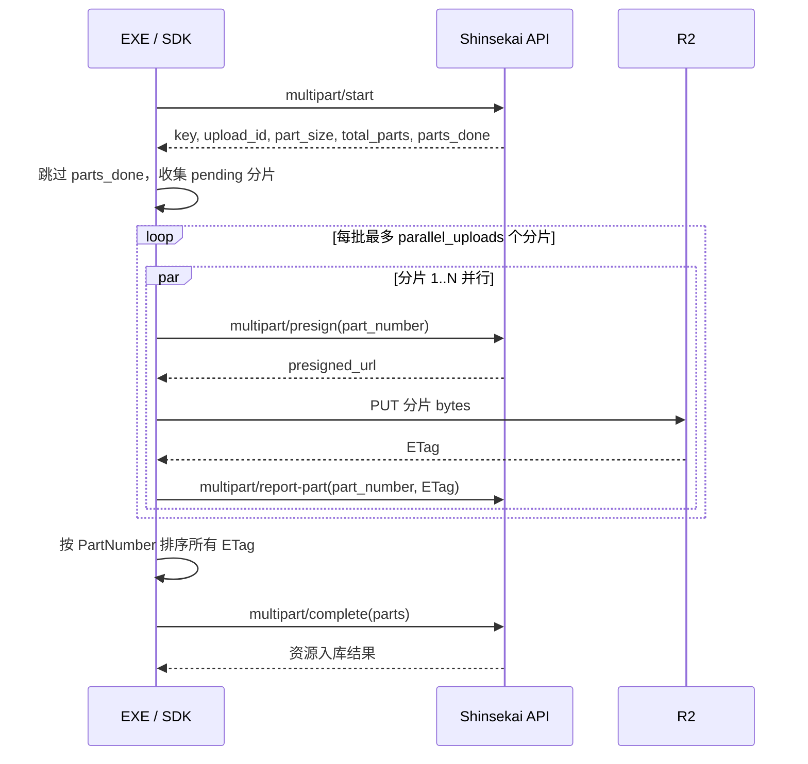

# Shinsekai Resource Upload SDK

面向 Shinsekai Resource Station 的 Python 上传 SDK。

SDK 封装了 `.char` 角色包与 `.bg` 背景包的上传流程，也封装了 EXE 客户端需要的设备认证、绑定码、预绑定、事后认领和并行分片上传。

## 目录

- [核心能力](#核心能力)
- [推荐接入流程](#推荐接入流程)
- [安装](#安装)
- [快速开始](#快速开始)
- [绑定与身份模型](#绑定与身份模型)
- [API 参考](#api-参考)
- [上传接口协议](#上传接口协议)
- [批量上传脚本](#批量上传脚本)
- [测试](#测试)
- [常见问题](#常见问题)

## 核心能力

| 能力 | 说明 |
|---|---|
| API Key 上传 | 作者已有上传 API Key 时，直接上传资源。 |
| EXE 设备认证 | EXE 在用户点击上传时生成或读取稳定 `device_id`，调用 `/auth/device` 获取身份。 |
| 固定绑定码 | `bind_code` 由服务端生成，同一用户身份下保持不变。EXE 不应本地生成六位绑定码。 |
| `?bind=` 自动同步 | EXE 上传后打开 `/resources?bind=XXXXXX`，网页可自动预绑定或管理 EXE 已上传资源。 |
| 预绑定 | EXE 首次上传前已知主用户绑定码时，可直接挂到主用户名下。 |
| 事后认领 | 一个游客设备已经上传过资源后，当前用户可用该游客绑定码建立共享管理关系。 |
| 并行分片上传 | `parallel_uploads` 支持顺序或并行上传分片。 |
| 断点续传 | 服务端返回 `parts_done` 时，SDK 会跳过已完成分片。 |
| 模型标签 | `verified_models` 只允许用于 `.char` / `character_pack`。 |

## 推荐接入流程

EXE 客户端推荐在用户点击上传按钮时才创建设备身份。这样不会在程序启动时无意义注册游客，也能保证上传动作和身份获取绑定在一起。



关键规则：

- `device_id` 是 EXE 本地保存的稳定 UUID。
- `bind_code` 是服务端返回的六位绑定码，不要在 EXE 本地生成。
- `fingerprint` 与网站保持一致：网站前端会把 GPU、CPU 核心数、平台、时区拼成原始字符串后先做 SHA-256，再把 64 位 hex 提交给 `/auth/device`。SDK 也会自动把非 64 位 hex 的原始指纹归一化成同样格式。
- 上传归属由 `Authorization` 里的 API Key 或 JWT 决定。
- SDK 会在设备模式上传时自动携带 `bind_code` 到上传 payload，供服务端未来校验或审计；当前网站源码的资源归属仍以 Bearer 认证身份为准，删除和编辑权限允许资源原作者或已 claim 该作者身份的用户。
- 如果 `/auth/device` 返回 `api_key: ""`，SDK 会自动改用 `access_token` 上传。

## 安装

```bash
pip install -r requirements.txt
```

依赖：

| 依赖 | 用途 |
|---|---|
| `requests>=2.31.0,<3` | 运行时 HTTP 请求。 |
| `pytest>=8.0.0,<9` | 本地测试。 |

## 快速开始

### 1. 最小实现：未绑定用户先上传，再用 `?bind=` 管理资源

这是 EXE 最推荐接入的主流程：用户不需要先注册、不需要先输入绑定码，也不需要提前打开网站。用户在 EXE 里点击上传时，SDK 生成或复用本机稳定 `device_id`，调用 `/auth/device` 获取服务端固定 `bind_code`，然后直接上传文件。上传后，EXE 的“浏览社区资源页”按钮打开 `/resources?bind=XXXXXX`，网站会自动把这批已上传资源接入当前网页身份，用户就能在网页端管理。

```python
from pathlib import Path
import os
import webbrowser

from shinsekai_upload_client import ShinsekaiUploadClient


def shinsekai_device_file() -> str:
    # 必须放在稳定位置。同一个文件会一直保存同一个 device_id，也就一直拿到同一个 bind_code。
    root = Path(os.getenv("APPDATA", ".")) / "Shinsekai"
    root.mkdir(parents=True, exist_ok=True)
    return str(root / "device_id.txt")


def make_client() -> ShinsekaiUploadClient:
    # 在用户点击上传或点击进入社区时调用都可以；SDK 会复用同一个 device_id 文件。
    return ShinsekaiUploadClient.from_device_file(
        shinsekai_device_file(),
        fingerprint=ShinsekaiUploadClient.normalize_fingerprint("gpu-renderer|8|win32|-540"),
        parallel_uploads=5,
    )


def on_upload_button_clicked(filepath: str):
    client = make_client()
    result = client.upload_resource(
        "七海千秋",
        filepath,
        "character_pack",
        uploader="作者名",
        description="角色包说明",
        verified_models=["GPT-Sovits", "Qwen"],
    )
    return result


def on_open_community_button_clicked():
    client = make_client()
    url = client.community_bind_url()
    webbrowser.open(url)
    return url
```

这个最小实现会得到这样的效果：

1. 用户第一次上传时，本地生成 `device_id` 文件。
2. 服务端为这个设备身份生成固定 `bind_code`。
3. 上传 payload 会自动携带该 `bind_code`，资源归属仍以当前 Bearer 身份为准。
4. 用户点击“浏览社区资源页”时，浏览器打开 `https://shinsekai.end0rph1n.icu/resources?bind=XXXXXX`。
5. 如果网页还没有身份，网站会用 `?bind=` 预绑定到 EXE 同一身份；如果网页已有游客或登录态，网站会 claim 这个 EXE 身份。
6. 绑定完成后，EXE 上传过的资源会出现在网页“我的资源”里，并可编辑、删除和管理。

### 2. API Key 上传

已有上传 API Key 的作者可以直接使用此模式。它保持旧行为，不会自动携带 `bind_code`。

```python
from shinsekai_upload_client import ShinsekaiUploadClient

client = ShinsekaiUploadClient(
    "sk-sn-your_key",
    base_url="https://api.end0rph1n.icu",
)

result = client.upload_resource(
    "七海千秋",
    "./nanami.char",
    "character_pack",
    uploader="作者名",
    description="角色包说明",
    verified_models=["GPT-Sovits", "Qwen"],
)

print(result["url"])
```

背景包示例：

```python
client.upload_resource(
    "教室背景",
    "./classroom.bg",
    "background_pack",
)
```

### 3. EXE 上传按钮

EXE 推荐在用户点击上传时调用 `from_device_file(...)`。

```python
from pathlib import Path
import os

from shinsekai_upload_client import ShinsekaiUploadClient


def shinsekai_device_file() -> str:
    # 推荐放在 AppData，避免因为工作目录变化导致设备身份丢失。
    root = Path(os.getenv("APPDATA", ".")) / "Shinsekai"
    root.mkdir(parents=True, exist_ok=True)
    return str(root / "device_id.txt")


def on_upload_button_clicked(filepath: str):
    client = ShinsekaiUploadClient.from_device_file(
        shinsekai_device_file(),
        fingerprint=ShinsekaiUploadClient.normalize_fingerprint("gpu-renderer|8|win32|-540"),
        parallel_uploads=5,
    )

    result = client.upload_resource(
        "七海千秋",
        filepath,
        "character_pack",
        uploader="作者名",
        description="角色包说明",
        verified_models=["GPT-Sovits", "Qwen"],
    )

    return {
        "upload": result,
        "bind_code": client.bind_code,
        "community_url": client.community_bind_url(),
    }
```

`from_device_file(...)` 会：

1. 读取本地 `device_id` 文件。
2. 文件不存在或为空时生成 UUID 并写入。
3. 调用 `/auth/device`。
4. 返回可上传的 `ShinsekaiUploadClient`。

### 4. EXE 首次上传前预绑定

如果用户已经知道网页账号或主设备的绑定码，可以在 EXE 首次上传时传入 `bind_code`。服务端会把当前 EXE `device_id` 直接挂到该绑定码对应的用户下。

```python
client = ShinsekaiUploadClient.from_device_file(
    shinsekai_device_file(),
    bind_code="A1B2C3",
    parallel_uploads=5,
)

client.upload_resource("七海千秋", "./nanami.char", "character_pack")
```

此模式下，EXE 上传的资源从一开始就属于绑定码对应的主用户。

### 5. 事后认领并管理游客资源

如果某个游客设备已经上传过资源，当前用户可以用该游客设备显示的绑定码建立共享管理关系。

```python
client = ShinsekaiUploadClient.from_device_file("./alice_device_id.txt")
auth = client.claim_bind_code("GUEST1")

print(auth.public_id)
print(auth.bind_code)
```

`/auth/device/claim` 当前通常不返回新的 API Key，因此响应里的 `api_key` 可能为空。SDK 会保留当前可用的 `client.api_key`，并用返回的 `access_token`、`public_id`、`bind_code`、`is_guest` 更新当前认证状态。

当前网站源码的 claim 语义是共享管理，不是迁移：服务端会在 `user_claims` 里记录“当前用户可管理目标游客资源”的关系，`/api/my-uploads` 会把当前用户自己的资源和已认领游客资源一起返回。目标游客不会失活，目标游客的资源 `user_id` 和 API Key 不会被改到当前用户名下；删除和编辑接口会额外检查 `user_claims`，所以认领方也可以管理这些资源。注意，删除是全局操作，一个认领方删除资源后，原游客和其他认领方列表里也会消失。

### 6. 打开社区资源页自动绑定

EXE 上传成功后，提供一个“进入社区资源页”按钮：

```python
url = client.community_bind_url()
print(url)
```

输出示例：

```text
https://shinsekai.end0rph1n.icu/resources?bind=A1B2C3
```

网页打开后会读取 `?bind=`：

- 如果网页已有登录态或游客态，调用 `/auth/device/claim` 共享 EXE 身份的已上传资源；这些资源会出现在 `/api/my-uploads`，可编辑和删除，但原归属不变。
- 如果网页没有身份，调用 `/auth/device` 并带 `bind_code` 做预绑定；此时网页直接成为 EXE 同一身份。
- 预绑定路径与 claim 路径都可以管理 EXE 资源；差别是预绑定成为同一身份，claim 只建立管理授权。

## 绑定与身份模型

### 三种入口

| 入口 | SDK / 网站动作 | 认证方式 | 说明 |
|---|---|---|---|
| 网页游客 | 网站自动调用 `/auth/device` | API Key 或 JWT | 浏览器生成 UUID，并可带指纹找回游客身份。 |
| EXE 游客 | SDK 调用 `from_device_file(...)` | API Key 或 JWT | EXE 保存稳定 `device_id` 文件，适合上传按钮触发。 |
| 注册用户 | 网站 `/auth/register` 创建或升级身份，随后 `/auth/login` 获取登录态 | JWT；如需程序化调用，可登录后通过 `/keys` 创建 API Key | 如果带同设备游客，会升级游客并保留资源。 |

### `device_id` 与 `bind_code`

| 字段 | 由谁生成 | 保存位置 | 是否稳定 | 用途 |
|---|---|---|---|---|
| `device_id` | SDK 或宿主程序 | EXE 本地文件 | 同一文件不变 | 找回同一设备身份。 |
| `bind_code` | 服务端 | 服务端用户字段 | 同一身份不变 | 预绑定到同一身份，或建立共享管理关系。 |

`from_device_file("./shinsekai_device_id.txt")` 的文件路径是相对当前工作目录的。打包 EXE 时不要依赖当前目录，建议放到 `%APPDATA%/Shinsekai/device_id.txt`。

### API Key 与 access_token

上传接口使用 Bearer 认证：

```http
Authorization: Bearer <api_key 或 access_token>
Content-Type: application/json
```

服务端为了安全，明文 API Key 可能只在创建时返回一次。同一设备再次认证时可能返回：

```json
{
  "access_token": "JWT",
  "api_key": "",
  "public_id": "shinsekai-xxxx",
  "bind_code": "A1B2C3",
  "is_guest": true
}
```

SDK 的处理规则：

- `api_key` 非空时，优先用 API Key 上传。
- `api_key` 为空但 `access_token` 非空时，用 JWT 上传。
- 二者都为空时，抛出 `ShinsekaiUploadError`。
- 长时间运行的 EXE 建议在每次点击上传时重新调用 `from_device_file(...)`，获取新的 `access_token`。

## API 参考

### `ShinsekaiUploadClient(...)`

```python
client = ShinsekaiUploadClient(
    api_key="sk-sn-your_key",
    base_url="https://api.end0rph1n.icu",
    access_token=None,
    timeout=60,
    upload_timeout=600,
    parallel_uploads=1,
)
```

| 参数 | 类型 | 默认值 | 说明 |
|---|---|---:|---|
| `api_key` | `str | None` | `None` | 上传 API Key。 |
| `base_url` | `str` | `https://api.end0rph1n.icu` | API 根地址。 |
| `access_token` | `str | None` | `None` | JWT。设备认证二次返回空 API Key 时使用。 |
| `timeout` | `int` | `60` | 普通 API 请求超时秒数。 |
| `upload_timeout` | `int` | `600` | R2 PUT 分片上传超时秒数。 |
| `parallel_uploads` | `int` | `1` | 默认分片并发数。`1` 为顺序上传；`5` 与网站当前上传器一致。 |

`api_key` 和 `access_token` 不能同时为空。

### `from_device_file(...)`

```python
client = ShinsekaiUploadClient.from_device_file(
    device_id_path="./shinsekai_device_id.txt",
    fingerprint=None,
    bind_code=None,
    base_url="https://api.end0rph1n.icu",
    parallel_uploads=1,
)
```

适合 EXE。它会读取或创建本地 `device_id` 文件，并调用 `/auth/device`。

`bind_code` 可选。填写时是预绑定，不填写时是普通设备认证。

### `from_device(...)`

```python
client = ShinsekaiUploadClient.from_device(
    device_id="stable-device-uuid",
    fingerprint=ShinsekaiUploadClient.normalize_fingerprint("gpu-renderer|8|win32|-540"),
    bind_code=None,
)
```

适合宿主程序自己管理 `device_id` 的场景。

`fingerprint` 可以传 64 位 SHA-256 hex，也可以传原始指纹字符串。SDK 会用 `normalize_fingerprint(...)` 归一化，避免超过后端 `max_length=64`，也保证 EXE 和网页端用同一套指纹格式匹配游客身份。

### `upload_resource(...)`

```python
result = client.upload_resource(
    name,
    filepath,
    resource_type,
    uploader="",
    description="",
    verified_models=None,
    progress=None,
    parallel_uploads=None,
)
```

| 参数 | 类型 | 必填 | 说明 |
|---|---|:---:|---|
| `name` | `str` | 是 | 资源显示名。 |
| `filepath` | `str` | 是 | 本地文件路径。 |
| `resource_type` | `str` | 是 | `character_pack` 或 `background_pack`。 |
| `uploader` | `str` | 否 | 展示字段，不决定资源归属。 |
| `description` | `str` | 否 | 资源描述。 |
| `verified_models` | `list[str] | tuple[str, ...] | None` | 否 | 仅 `character_pack` 可用。 |
| `progress` | `Callable[[UploadProgress], None] | None` | 否 | 进度回调。 |
| `parallel_uploads` | `int | None` | 否 | 仅覆盖本次上传并发数。传 `5` 可对齐网站上传器。 |

文件类型规则：

| `resource_type` | 文件后缀 | `verified_models` |
|---|---|---|
| `character_pack` | `.char` | 可用。 |
| `background_pack` | `.bg` | 禁止。 |

允许的 `verified_models`：

```python
["GPT-Sovits", "Genie", "MiniMax", "Qwen"]
```

SDK 会去重并保持顺序。未知模型名会抛出 `ValueError`。

成功返回值由服务端 `/api/resources/multipart/complete` 决定。当前常见结构：

```json
{
  "id": 101,
  "name": "七海千秋",
  "type": "character",
  "uploader": "作者名",
  "time": "2026-05-18",
  "url": "https://r2.end0rph1n.icu/uploads/character_pack/nanami.char"
}
```

### `community_bind_url(...)`

```python
url = client.community_bind_url(
    web_url="https://shinsekai.end0rph1n.icu",
    path="/resources",
)
```

要求当前客户端已经有 `bind_code`。通常只有 `from_device(...)` 或 `from_device_file(...)` 创建的客户端才有。

### `build_bind_url(...)`

```python
url = ShinsekaiUploadClient.build_bind_url(
    "A1B2C3",
    web_url="https://shinsekai.end0rph1n.icu",
    path="/resources?tab=mine",
)
```

返回：

```text
https://shinsekai.end0rph1n.icu/resources?tab=mine&bind=A1B2C3
```

### `normalize_fingerprint(...)`

```python
fingerprint = ShinsekaiUploadClient.normalize_fingerprint(
    "gpu-renderer|8|win32|-540"
)
```

返回 64 位小写 SHA-256 hex。网站前端也是先把原始设备特征做 SHA-256，再提交给 `/auth/device`；EXE 如果希望和网页游客通过同一指纹找回身份，应使用同样的原始字段顺序和归一化结果。

### `claim_bind_code(...)`

```python
auth = client.claim_bind_code("GUEST1")
```

调用 `/auth/device/claim`，把另一个游客绑定码对应的资源共享给当前用户管理。资源原归属不变，但当前用户可以通过 `list_my_uploads()` 看到，并通过 `edit_resource(...)`、`delete_resource(...)` 管理。

### `list_my_uploads()`

```python
uploads = client.list_my_uploads()
```

调用 `/api/my-uploads`，返回当前身份可管理的资源列表。列表包含自己上传的资源，也包含通过绑定码 claim 到的资源。

### `edit_resource(...)`

```python
updated = client.edit_resource(
    101,
    name="新名称",
    description="新描述",
    tags=["剧情向", "中文"],
    verified_models=["GPT-Sovits"],
    resource_type="character_pack",
)
```

调用 `PATCH /api/resources/{id}`。`name`、`description`、`tags`、`verified_models` 至少传一个。`verified_models` 只应给角色包使用；传 `verified_models` 时 SDK 要求同时传 `resource_type="character_pack"` 或 `resource_type="character"`，避免背景包误带模型参数。

### `delete_resource(...)`

```python
client.delete_resource(101)
```

调用 `DELETE /api/resources/{id}`。服务端允许资源原作者删除，也允许 claim 过该资源所属游客身份的用户删除。删除会让该资源从所有用户的可见列表中消失。

### `merge_with_bind_code(...)` 与 `merge_device(...)`

```python
auth = client.merge_with_bind_code("A1B2C3")
```

这是旧版 `/auth/device/merge` 的兼容入口。新接入优先使用：

- 首次上传前已知主用户绑定码：`from_device_file(..., bind_code="A1B2C3")`
- 事后认领另一个游客：`claim_bind_code("GUEST1")`

### `list_pending()` 与 `delete_pending(...)`

```python
pending = client.list_pending()
client.delete_pending(pending_id=7)
```

用于查看和删除当前身份下未完成的 multipart 上传任务。

### `DeviceAuthInfo`

设备认证相关方法会写入或返回 `DeviceAuthInfo`。

```python
DeviceAuthInfo(
    access_token="JWT",
    api_key="sk-sn-...",
    public_id="shinsekai-xxxx",
    bind_code="A1B2C3",
    is_guest=True,
    device_id="stable-device-uuid",
    refresh_token="",
)
```

注意：`api_key` 可能为空；此时 SDK 使用 `access_token` 上传。

### `UploadProgress`

进度回调接收 `UploadProgress`：

```python
def on_progress(p):
    print(
        p.stage,
        f"{p.percent:.0f}%",
        p.message,
        f"{p.chunk_speed_mbps:.1f} MB/s",
    )

client.upload_resource(
    "七海千秋",
    "./nanami.char",
    "character_pack",
    progress=on_progress,
)
```

字段：

| 字段 | 说明 |
|---|---|
| `stage` | `hashing`、`started`、`uploading`、`completing`、`done`。 |
| `message` | 人类可读状态。 |
| `uploaded_bytes` | 已上传字节数。 |
| `total_bytes` | 总字节数。 |
| `part_number` | 当前分片号。 |
| `total_parts` | 总分片数。 |
| `chunk_speed_mbps` | 当前分片速度。 |
| `avg_speed_mbps` | 本轮上传平均速度。 |
| `percent` | 计算属性，上传百分比。 |

## 上传接口协议

网站源码里，小于等于 20MB 的文件会走 `/api/resources/presign` + `/api/resources/confirm` 的直传链路，大文件走 multipart 链路。SDK 为了统一断点续传、并行分片和错误处理，当前统一使用 multipart 上传链路；后端支持单分片 multipart，因此小文件也可以正常上传。

### 1. 初始化上传

```http
POST /api/resources/multipart/start
Authorization: Bearer <api_key 或 access_token>
Content-Type: application/json
```

请求体：

```json
{
  "display_name": "七海千秋",
  "filename": "nanami.char",
  "resource_type": "character_pack",
  "total_size": 1048576,
  "content_type": "application/octet-stream",
  "sha256": "hex sha256",
  "bind_code": "A1B2C3",
  "verified_models": ["GPT-Sovits", "Qwen"]
}
```

说明：

- `bind_code` 只有设备认证客户端会自动携带。
- `verified_models` 只有 `character_pack` 且参数非空时携带。
- `background_pack` 不会发送 `verified_models`。

响应：

```json
{
  "key": "uploads/character_pack/nanami.char",
  "upload_id": "multipart-upload-id",
  "part_size": 20971520,
  "total_parts": 1,
  "pending_id": 7,
  "parts_done": [],
  "parts_done_count": 0,
  "resumed": false
}
```

如果服务端返回 `parts_done`，SDK 会跳过这些分片。

### 并行上传逻辑

网站当前上传器使用固定 `CONC = 5` 的分片并行策略。它不是把所有分片一次性无上限丢出去，而是先从 `/api/resources/multipart/start` 拿到 `part_size`、`total_parts` 和 `parts_done`，再把未完成分片按 5 个一批执行。每个分片内部顺序固定为：`presign -> PUT -> report-part`。



SDK 对应关系：

- `parallel_uploads=1`：顺序上传，最稳，适合排错或弱网络。
- `parallel_uploads=5`：与网站当前上传器一致，最多同时上传 5 个分片。
- 构造客户端时传 `parallel_uploads=5` 会作为默认并发数；调用 `upload_resource(..., parallel_uploads=5)` 可以只覆盖本次上传。
- `/multipart/start` 返回的 `parts_done` 会先放入 `partsByNumber`，这些分片不会重复 PUT。
- 新上传分片每完成一片就调用 `/multipart/report-part`，服务端因此可以在刷新页面、重启 EXE 或网络中断后继续返回已完成分片。
- `/multipart/complete` 必须提交完整分片列表，SDK 会把 `parts_done` 和本轮新上传的分片合并后按 `PartNumber` 排序。

等价伪代码：

```text
start = multipart/start(...)
partsByNumber = {part.PartNumber: part for part in start.parts_done}
pending = [part for part in all_parts if part.number not in partsByNumber]

for batch in chunks(pending, parallel_uploads):
    run batch concurrently:
        presigned_url = multipart/presign(part.number)
        etag = PUT(presigned_url, part.bytes)
        require etag
        multipart/report-part(part.number, etag)
        partsByNumber[part.number] = {PartNumber: part.number, ETag: etag}

multipart/complete(parts=sort(partsByNumber.values(), by PartNumber))
```

实现细节上，网站用 `Promise.all(batch.map(...))` 控制每批 5 个分片；Python SDK 用 `ThreadPoolExecutor(max_workers=parallel_uploads)` 实现同等并发上限。SDK 在并行线程里使用独立的 R2 `PUT` 请求，并给 API JSON 请求加锁，避免多个线程同时复用同一个 `requests.Session` 写状态。

### 2. 获取分片预签名 URL

```http
POST /api/resources/multipart/presign
```

请求体：

```json
{
  "key": "uploads/character_pack/nanami.char",
  "upload_id": "multipart-upload-id",
  "part_number": 1
}
```

响应：

```json
{
  "key": "uploads/character_pack/nanami.char",
  "upload_id": "multipart-upload-id",
  "part_number": 1,
  "presigned_url": "https://..."
}
```

### 3. PUT 分片到 R2

SDK 使用预签名 URL 直接上传分片：

```http
PUT <presigned_url>
Content-Type: application/octet-stream
```

R2 必须返回 `ETag`。缺少 `ETag` 时 SDK 会抛出 `ShinsekaiUploadError`。

### 4. 上报分片完成

```http
POST /api/resources/multipart/report-part
```

请求体：

```json
{
  "key": "uploads/character_pack/nanami.char",
  "upload_id": "multipart-upload-id",
  "part_number": 1,
  "etag": "\"etag-value\""
}
```

### 5. 完成上传

```http
POST /api/resources/multipart/complete
```

请求体：

```json
{
  "key": "uploads/character_pack/nanami.char",
  "upload_id": "multipart-upload-id",
  "name": "七海千秋",
  "resource_type": "character_pack",
  "uploader": "作者名",
  "description": "角色包说明",
  "sha256": "hex sha256",
  "bind_code": "A1B2C3",
  "verified_models": ["GPT-Sovits", "Qwen"],
  "parts": [
    {"PartNumber": 1, "ETag": "\"etag-value\""}
  ]
}
```

响应示例见 [`upload_resource(...)`](#upload_resource)。

## 批量上传脚本

仓库提供 `upload_apikey.py` 作为简单批量上传脚本。它保留源文件内配置的方式，适合本地操作。

核心配置：

```python
API = "https://api.end0rph1n.icu"

API_KEY = "sk-sn-your_key"
USE_DEVICE_AUTH = False

DEVICE_ID_FILE = "./shinsekai_device_id.txt"
DEVICE_ID = ""
DEVICE_FINGERPRINT = ""
PREBIND_CODE = ""
CLAIM_BIND_CODE = ""
PARALLEL_UPLOADS = 5

UPLOADS = [
    ("七海千秋", "./nanami.char", "character_pack", "作者名", "角色包说明", ["GPT-Sovits", "Qwen"]),
    ("教室背景", "./classroom.bg", "background_pack", "作者名", "背景包说明"),
]
```

运行：

```bash
python -X utf8 upload_apikey.py
```

`UPLOADS` 每项格式：

```python
(name, filepath, resource_type, uploader, description, verified_models)
```

`verified_models` 是可选的第六项，且只能用于 `character_pack`。

## 测试

本地测试不访问线上服务，全部使用模拟服务端。

```bash
python -m pytest tests -q
```

当前离线测试数量：`34`；另有 `8` 个线上冒烟测试和 `14` 个破坏性全量线上测试默认跳过。完整测试矩阵与线上启动方式见 [TESTCASES.md](TESTCASES.md)。

### SDK 行为测试

| 用例 | 覆盖点 |
|---|---|
| `test_validation_and_helpers` | 参数校验、绑定码标准化、进度百分比。 |
| `test_device_id_file_create_and_reuse` | 本地 `device_id` 文件创建与复用。 |
| `test_device_auth_from_device_and_file` | `/auth/device` 普通设备认证。 |
| `test_device_auth_without_api_key_uses_access_token_for_upload` | `/auth/device` 返回空 `api_key` 时使用 `access_token` 上传。 |
| `test_device_auth_prebind` | `/auth/device` 带 `bind_code` 预绑定。 |
| `test_claim_bind_code` | `/auth/device/claim` 认领后更新认证状态。 |
| `test_merge_compatibility` | 兼容旧 `/auth/device/merge`。 |
| `test_sequential_upload_full_chain` | 顺序 multipart 上传全链路。 |
| `test_device_upload_includes_bind_code_metadata` | 设备模式上传自动携带 `bind_code`。 |
| `test_character_upload_includes_verified_models` | `.char` 上传携带模型标签并去重。 |
| `test_background_upload_rejects_verified_models` | `.bg` 禁止模型标签。 |
| `test_rejects_unknown_verified_model` | 未知模型名拒绝上传。 |
| `test_parallel_upload_full_chain` | 并行分片上传。 |
| `test_resume_upload_skips_finished_parts` | 断点续传跳过已完成分片。 |
| `test_pending_list_and_delete` | 查询和删除 pending 上传。 |
| `test_resource_management_methods` | 查询我的资源、编辑资源、删除资源，以及模型参数校验。 |
| `test_error_paths` | HTTP、JSON、PUT、ETag 等错误路径。 |
| `test_upload_apikey_module_import` | 批量脚本可导入。 |

### 绑定业务场景测试

| 用例 | 覆盖点 |
|---|---|
| `test_q1_browser_guest_upload_then_exe_prebind_syncs_files` | 浏览器游客上传后，EXE 用浏览器绑定码预绑定，双向可见。 |
| `test_q2_new_browser_with_same_fingerprint_recovers_guest_identity` | 换浏览器但指纹相同，找回游客身份和文件。 |
| `test_q2_sdk_raw_fingerprint_matches_browser_hashed_fingerprint` | SDK 原始指纹规整后与浏览器哈希指纹命中同一身份。 |
| `test_q3_register_keeps_bind_code_and_old_guest_key` | 游客注册后绑定码不变，旧游客 API Key 仍可用。 |
| `test_q4_exe_first_upload_then_community_url_auto_binds_browser` | EXE 先上传，浏览器无身份时通过 `/resources?bind=` 预绑定到同一身份。 |
| `test_q4_existing_browser_guest_opens_exe_bind_url_claims_exe_files` | 已有浏览器游客打开 EXE 的 `?bind=` 时走 claim，共享管理 EXE 资源。 |
| `test_q5_bind_code_is_stable_across_auth_register_and_prebind` | 多次认证、注册、预绑定后绑定码保持稳定。 |
| `test_e1_old_guest_api_key_still_works_after_register_upgrade` | 旧游客 API Key 在注册升级后仍能上传。 |
| `test_e2_repeated_prebind_same_device_does_not_create_extra_user` | 同设备重复预绑定不创建多余用户。 |
| `test_e3_claim_already_bound_is_idempotent_and_self_is_rejected` | 重复认领同一已绑定设备幂等返回，认领自己仍拒绝。 |
| `test_e3_claim_already_bound_by_another_user_returns_current_identity` | 同一游客码可被多个用户 claim；各方可管理游客资源，但不会互相暴露私有资源。 |
| `test_e4_no_bind_creates_normal_guest` | 无 `bind_code` 时正常创建游客。 |
| `test_e4_invalid_bind_falls_back_to_normal_guest_without_merge` | 不存在的 6 位绑定码不会合并资源，会退回普通游客认证。 |
| `test_e5_guest_upload_then_exe_claim_shares_source_files_one_way` | 游客上传后被 EXE claim，EXE 可管理游客资源，游客不继承 EXE 私有资源。 |
| `test_shared_claim_does_not_share_claimant_private_files_between_claimants` | 多个用户 claim 同一游客码时，只共享管理该游客资源，不共享认领方各自私有资源。 |
| `test_claimed_resource_can_be_edited_and_deleted_by_claimant` | claim 后认领方可以编辑和删除源游客资源，未认领用户仍会被拒绝。 |

## 常见问题

### EXE 是否要自己生成六位绑定码？

不要。EXE 只生成或保存 `device_id`。六位 `bind_code` 必须来自服务端 `/auth/device`。

### 为什么 `/auth/device` 有时返回空 `api_key`？

服务端可能只在创建 device-key 时返回一次明文 API Key。之后同设备认证会返回 `access_token`，避免重复暴露明文 API Key。SDK 已兼容这种情况。

### SDK 用户不注册也能上传，是怎么验证的？

SDK 走 `/auth/device` 时，服务端会用稳定 `device_id` 创建或找回一个 `role=device` 的游客身份，并返回 `access_token`，首次创建 device-key 时还会返回 API Key。上传接口用 Bearer 认证查到这个游客用户后，把资源写到该用户 `user_id` 名下。也就是说，SDK 用户不需要邮箱密码注册，但仍然有服务端身份和认证令牌。

### `client.bind_code` 会不会变？

只要服务端身份不变，`bind_code` 不应改变。同一 EXE 的关键是不要丢失本地 `device_id` 文件。

### `bind_code` 会写进 `.char` 或 `.bg` 文件吗？

不会。SDK 只把 `bind_code` 放入上传请求 payload，作为服务端未来可用的校验或审计元数据；当前网站源码并不把这个字段写进 `.char` / `.bg` 文件本体，也不靠它决定资源归属。

### 上传归属由 `uploader` 决定吗？

不是。`uploader` 只是页面展示字段。资源归属由服务端根据当前 Bearer 认证身份决定。

### `verified_models` 可以传给背景包吗？

不能。`verified_models` 只支持 `character_pack` / `.char`。传给 `background_pack` 会抛出 `ValueError`。

### 并行上传开多少合适？

默认 `parallel_uploads=1` 最稳。网站当前上传器是 `5` 路并行；EXE 客户端想保持同款体验可以设为 `5`，弱网络或排错时降到 `3` 或 `1`。过高并发可能触发网络、R2 或服务端限流问题。

### access_token 过期怎么办？

设备模式建议每次点击上传时重新调用 `from_device_file(...)`。它会用稳定 `device_id` 重新认证并获取新的 `access_token`。

### 线上接口失败时 SDK 会抛什么？

一般是：

| 异常 | 场景 |
|---|---|
| `ValueError` | 参数为空、不合法、模型标签不允许。 |
| `FileNotFoundError` | 本地文件不存在。 |
| `ShinsekaiUploadError` | HTTP 非 2xx、返回非 JSON、缺少字段、R2 PUT 失败、缺少 ETag。 |
